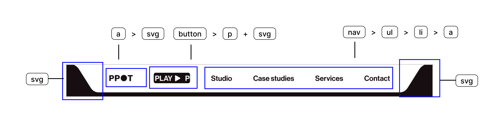
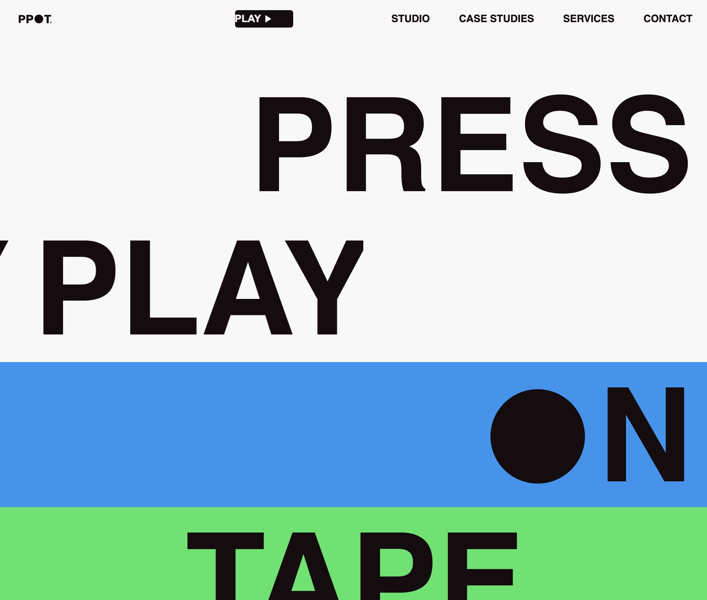
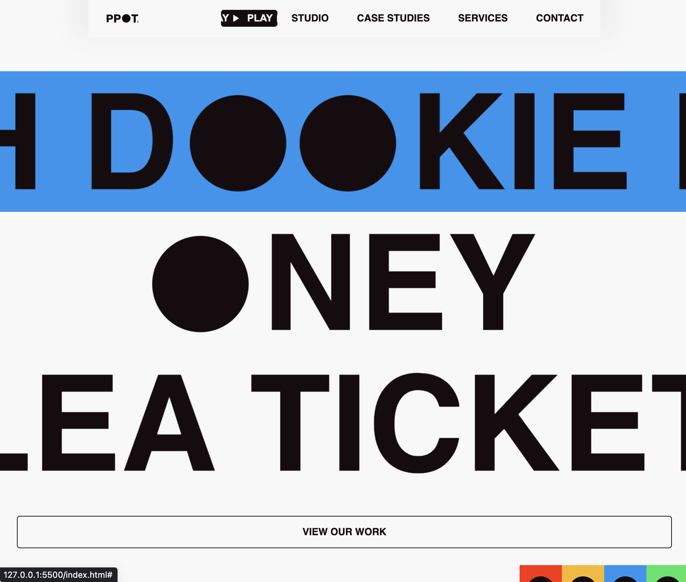
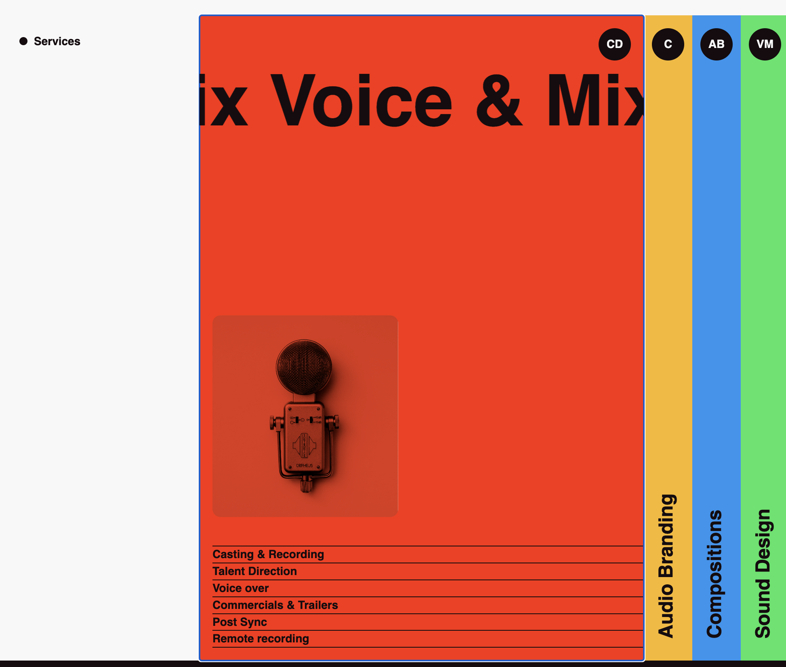
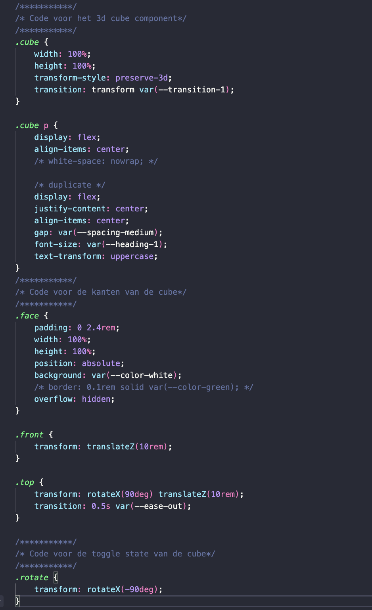
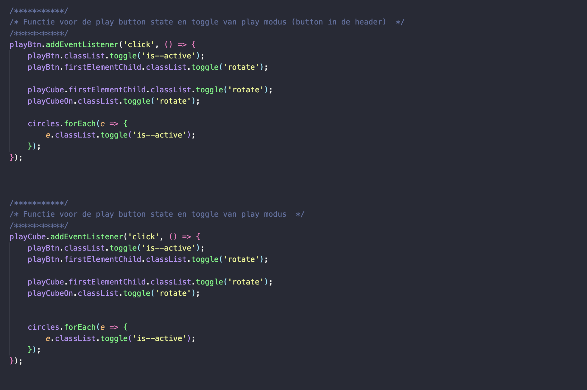

# Procesverslag
Markdown is een simpele manier om HTML te schrijven.  
Markdown cheat cheet: [Hulp bij het schrijven van Markdown](https://github.com/adam-p/markdown-here/wiki/Markdown-Cheatsheet).

Nb. De standaardstructuur en de spartaanse opmaak van de README.md zijn helemaal prima. Het gaat om de inhoud van je procesverslag. Besteedt de tijd voor pracht en praal aan je website.

Nb. Door *open* toe te voegen aan een *details* element kun je deze standaard open zetten. Fijn om dat steeds voor de relevante stuk(ken) te doen.

## Jij

  
uitwerken voor kick-off werkgroep

  ### Auteur:
  Jake Posthouwer

  #### Je startniveau:
  Zwarte piste

  #### Je focus:
  Surface plane, ik ben opzoek naar meer uitdaging en vrijheid in het uitvoeren van technische experimenten
 

## Je website

  
uitwerken voor kick-off werkgroep

  ### Je opdracht:
  link naar de website die je gaat namaken óf de naam/omschrijving van je eigen ontwerp
  https://pressplayontape.studio

  #### Screenshot(s) van de eerste pagina (small screen): 
  Homescreen  
  

  #### Screenshot(s) van de tweede pagina (small screen):
 In goed overleg met Sanne hebben wij besloten dat ik mij volledig ga focussen op de homepagina ivm de complexiteit van mijn site
 

## Toegankelijkheidstest 1/2 (week 1)

  
uitwerken na test in 2e werkgroep

  ### Bevindingen
  Lijst met je bevindingen die in de test naar voren kwamen:

  Mijn belangerijkste bevindingen uit mijn eerst toegankelijkheidstest waren dat de site meerdere H1 elementen gebruikten op dezelfde pagina in plaats van dat ze semantisch correct gebruik maken van de heading elementen, daarnaast viel het mij ook op dat er meerdere heading elementen niet in de juiste volgorde gebruikt werden. 

  De site had horizontale scroll en door de hele site heen was er niet correct gebruik gemaakt van html tags waardoor het voor een screenreader erg lastig te gebruiken was. Ook maakt de site veel gebruik van animaties zonder dat er een function was om deze uit te zetten of te verminderen.

## Breakdownschets (week 1)

  
uitwerken na afloop 3e werkgroep

  ### de hele pagina: 
  

  ### dynamisch deel (bijv menu): 
  

## Voortgang 1 (week 2)

  
uitwerken voor 1e voortgang

  ### Stand van zaken
  Deze week heb ik me gericht op het uitkiezen van een site met wat uitdaging, ik had een site gekozen waar ik tevreden mee was maar na de eerste page gemaakt te hebben wilde ik toch wat meer uitdaging dus koos ik voor een nieuwe site waar ik op toegankelijkheid wilde inspelen met een focus op animaties, 3D-objecten.

  ook heb ik mij gericht op het waarborgen van de semantische correctheid van de HTML-structuur. Hierbij heb ik geprobeerd het aantal div-elementen te minimaliseren.

  ### Agenda voor meeting
  samen met je groepje opstellen

  Agenda punt 1: semantisch correcte html 
  Agenda punt 2: welke animaties met javascript welke met css
  Agenda punt 3: font face inladen

  ### Verslag van meeting
  hier na afloop snel de uitkomsten van de meeting vastleggen

## Voortgang 2 (week 3)

  
uitwerken voor 2e voortgang

  ### Stand van zaken
  Deze week ben ik voornaamelijk aan de slag gegaan met JavaScript en de 3D-effecten, ik had nog nooit eerder met 3D gewerkt. Hiervoor heb ik onderzoek gedaan en mijzelf aangeleerd hoe ik 3d objecten kan creeeren met html en css. 

  ### Agenda voor meeting

  We hebben een agenda met de volgende punten opgesteld:
  - Ik wil de foto op me homepage als achtergrond hebben van en ul en ik wil een paar fotos verder in me pagina als carrousel gaan gebruiken.
  - Svg foutmeldingen en hoe ik een overflow met fotos oneindig kan laten scrollen zegmaar dat ie telkens weer bij het begin uitkomt.
  - Ik heb een vraag over hoe hoe ik dingen het best kan schalen. Daarbij heb ik ook een stukje waar ik een image wil laten overflowen.
  - 3d object optimaliseren css

  ### Verslag van meeting
  Helaas kon ik niet aanwezig zijn bij de feedbacksessie vanwege een ongelukkige planning in het rooster. Deze planning maakte het praktisch onmogelijk om op tijd de trein te nemen en de sessie bij te wonen. 

## Toegankelijkheidstest 2/2 (week 4)

  
uitwerken na test in 9e werkgroep

  ### Bevindingen
  Lijst met je bevindingen die in de test naar voren kwamen (geef ook aan wat er verbeterd is):
  
  Ik heb deze week mijn eigen site getest op toegankelijkheid, hier kwam uit dat mijn site aanzienelijk toeganekelijker is dan de orginele site. mijn site heeft een fucntie voor zowel darkmode als om animatie te verminderen. ik maak gebruik van de juiste html tags en heading levels en mijn site is schaalbaar. wel gebruik ik nog veel divs maar door de complexiteit van mijn site is dat niet te voorkomen. maar ten opzichte van de orginele site is het aanzienlijk beter.

## Voortgang 3 (week 4)

  
uitwerken voor 3e voortgang

  ### Stand van zaken
  Deze week heb ik mij beziggehouden met het optimaliseren van verschillende aspecten van mijn websiteproject. Een cruciale focus lag op het verbeteren van de HTML-structuur, waarbij ik ervoor zorgde dat de code niet alleen semantisch correct was, maar ook efficiënt en goed leesbaar.

  Ik heb javascript functies gemaakt om onder andere de navigatie dynamisch te maken en om de muziek button/modus state en ik heb verticale toggle gemaakt. hier heb ik nog nooit eerder mee gewerkt dus hier was ik veel tijd aan kwijt door al het onderzoek wat ik heb moeten doen. Het was erg lastig deze werkend te maken omdat hij erg happerde en ik de richting van de animatie moest aanpassen (manipuleren) na veel tijd en onderzoek is het mij uiteindelijk gelukt. ik heb het op kunnen lossen met direction property ltr.

  Ik liep er tegen aan dat het erg lastig was om 3d objecten schaalbaar te maken omdat ze een vast waarde hebben. ik heb dit uiteindelijk op kunnen lossen door er containers omheen te zetten maar hierdoor had ik erg veel divs nodig.

  ### Agenda voor meeting
  samen met je groepje opstellen

  - semantisch correct geschreven code
  - hoe kan ik de hover op mijn 3d punten soepel werkend maken
  
  ### Verslag van meeting
  hier na afloop snel de uitkomsten van de meeting vastleggen
  Tijdens de feedbacksessie met de student assistent kreeg ik niet veel specifieke opmerkingen of suggesties. de sessie verliep vrij vlot, en er eigenlijk geen punten ter verbetering. Hoewel ik positief sta tegenover de bevestiging van sterke punten, had ik graag constructieve kritiek gehad waar ik iets aan had om mijn site en skills naar een volgend level te tillen.

## Eindgesprek (week 5)

  
uitwerken voor eindgesprek

  ### Je uitkomst - karakteristiek screenshots:
  
  
  

  ### Dit ging goed/Heb ik geleerd: 
  Korte omschrijving met plaatjes

Onlangs heb ik ontdekt hoe ik 3D-objecten kan maken met behulp van CSS, wat een toevoeging is aan mijn vaardigheden in webontwikkeling. Dit leerproces was zowel uitdagend als verrijkend, omdat ik me verdiepte in CSS-transformaties en -animaties om driedimensionale effecten te creëren. Het begrip van concepten zoals perspectief, rotaties en translaties in CSS heeft mijn inzicht in webdesign aanzienlijk vergroot.

Met deze nieuwe kennis kan ik nu meer dan alleen platte, tweedimensionale elementen ontwerpen. Het vermogen om diepte en dynamiek toe te voegen aan mijn projecten opent de deur naar creatievere en lastigere design en sites. 

ook heb ik me verdiept in het schrijven van semantische code voor websites, met de specifieke focus om het gebruik van divs en classes tot een minimum te beperken. Deze nieuwe kennis heeft mijn aanpak van webontwikkeling veranderd en heeft geleid tot een meer gestructureerde en begrijpelijke codebasis.

Terwijl ik me verdiepte in semantisch schrijven, lag de nadruk op het doelbewust gebruiken van HTML-tags op een betekenisvolle manier. In plaats van vaak generieke div-elementen te gebruiken, koos ik ervoor om specifieke HTML-tags te benutten die de inhoud en structuur van de pagina nauwkeuriger weergeven. Deze aanpak draagt niet alleen bij aan een betere leesbaarheid van de code, maar bevordert ook de toegankelijkheid voor zowel gebruikers als zoekmachines.

Daarnaast heb ik actief gestreefd naar het minimaliseren van het aantal classes en deze alleen toe te voegen waar strikt noodzakelijk. Door duidelijke en beschrijvende tags te gebruiken, kon ik de afhankelijkheid van extra classes verminderen, wat resulteerde in een overzichtelijkere en gemakkelijker te onderhouden codebasis.

  
  

  Ik heb geleerd verticale toggles te maken
  Ik heg geleerd te werken met each loop

  ### Dit was lastig/Is niet gelukt:
  Korte omschrijving met plaatjes
  Het was voor mij een uitdaging om de juiste HTML-tags te gebruiken, voornamelijk vanwege mijn eerdere ervaringen tijdens mijn vorige studie en banen, waar ik gewend was geraakt aan het werken met divs. In die context werden div-elementen vaak gebruikt als veelzijdige containers om de structuur van een webpagina te definiëren.
  
  De horinzontale scroll voor elementen verliep niet goed omdat het de structuur van de site brak. Ik moest dit oplossen door met overflow en absolute positioneringen te werken. Daarnaast was de HTML niet toegankelijk door de tekst animaties, en moest ik gebruikmaken van aria-labels om het probleem op te lossen.
  

## Bronnenlijst

  
continu bijhouden terwijl je werkt

  1. Infinite horizontale scroll met css 
  https://www.myoussouf.com/blog/horizontal-scrolling-text-css
  
  2. 3d objecten maken
  https://3dtransforms.desandro.com/cube

  3. Functie voor het togglen van en sticky header wanneer je naar boven scrollt
  ChatGPT (als hulpmiddel voor het oplossen van een foutmelding)

